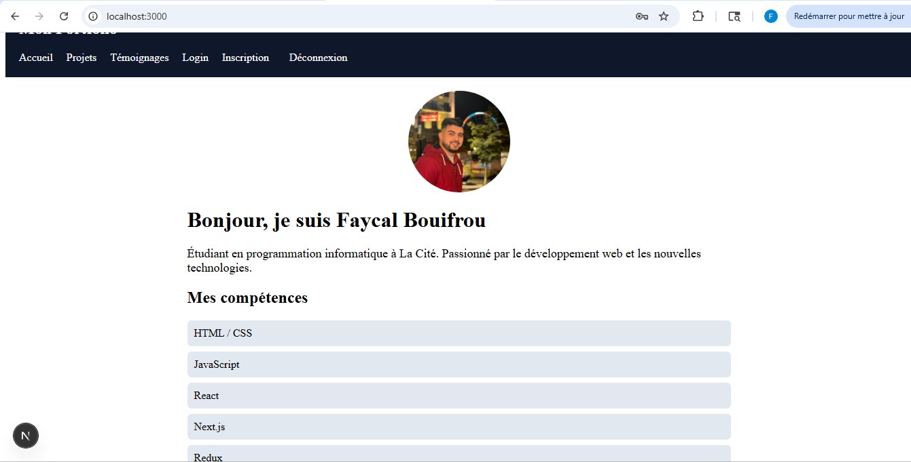
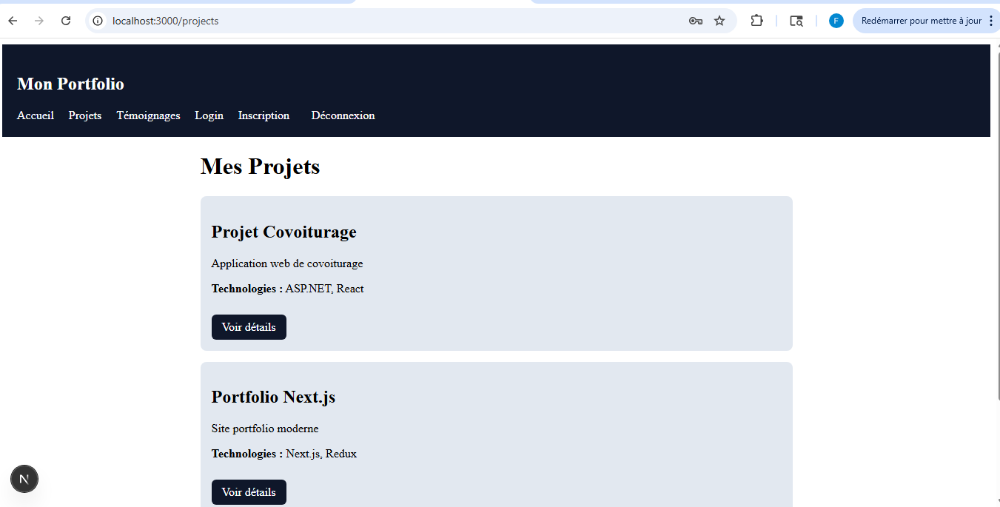
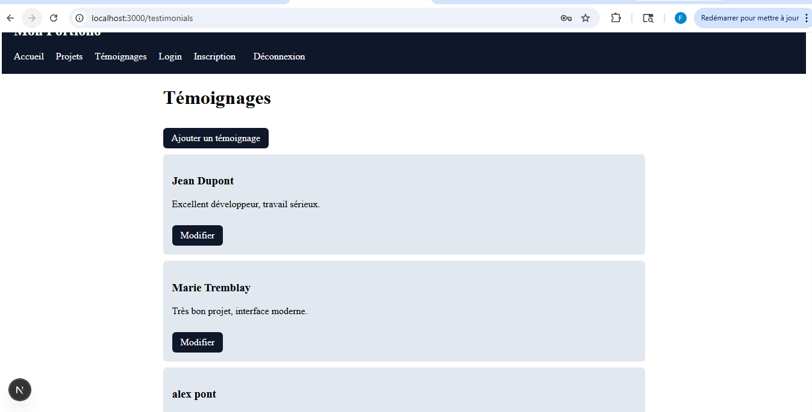

# Portfolio Next.js

##  Description
Application web portfolio développée avec **Next.js** permettant de présenter des projets, gérer des témoignages et implémenter une authentification utilisateur.

---

##  Fonctionnalités

-  Authentification (Login / Register)
- Gestion utilisateur avec Redux Toolkit
-  Protection des pages
- Affichage des projets
- Détails des projets
-  Témoignages (ajouter / modifier)
-  Interface moderne avec CSS

---

##  Technologies utilisées

- Next.js
- React
- Redux Toolkit
- SQLite
- Sequelize
- CSS

---

## Aperçu de l'application

### Accueil


###  Projets


###  Témoignages


---

##  Installation

```bash
npm install
npm run dev

##Auteur

Faycal Bouifrou

Étudiant en programmation informatique à La Cité